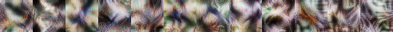

# lucid-spritemaps

This kit is a workshop for building batches of Lucid visualizations, and sprite-sheet images, from series of TensorFlow frozen graphs.

The **vis/eb_12_v07_480x270_01b** directory contains a working example with sample results. 

This kit depends on **tensorflow** & **lucid**, **copy**, **json**, **math**, **numpy**, **os**, **pandas**, **PIL**, & **time**

This kit comprises:

1. A **graphs** directory containing two series of frozen graph instances: 
    eb_12_v07_480x270_01b:  [ "100k", "500k" ] 
    eb_12_v07_480x270_01c:  [ "400k", "500k" ]
    
    
2. A **lib** directory containing Python modules.

3. A **vis** directory containing a working example.

Everything happens from the **vis** directory.
See the README.md file there for further details.

